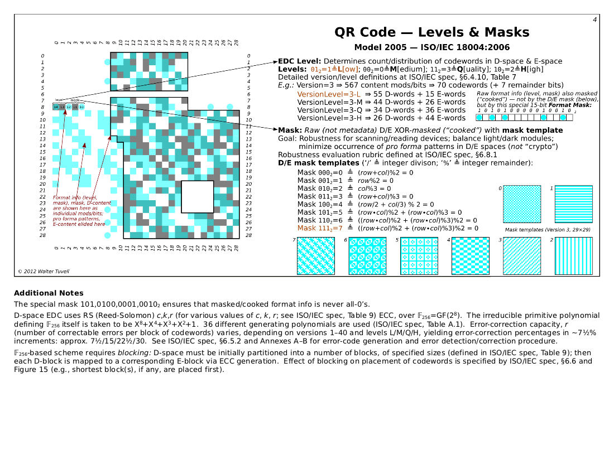
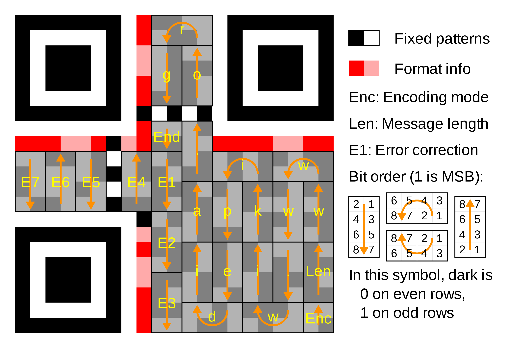

# Decoding QR Codes

## Positioning Markers
The three big squares (top left,  top right and bottom left) are for positioning the QR code.
To make our life easier we are going ignore these,  as our image is already correctly orientated.


## Step 1 - Read Image
Convert the `dojo.png` into a grid of black and white modules.
Each module is 8x8 pixels.  A module will represent '1 bit' of data.

If you want to skip this step,  then the file `raw.txt` can be used.

## Step 2 - Version
Work out the version of the QR code using this formula:

`version = (width - 17) / 4`

## Step 3 - Format Information
Under the top left positioning marker, is a line of white modules.  This is called the quiet zone.
The line under this line contains the format information.  
It contains 2 bits for the error correction level and then 3 bits for the mask.

Process is:
* Read the first 5 (bits) modules from the line
* Black means 1 and white means 0.  (ie.  Black Black White White White is 11000)
* XOR the value with 10101 (called the format mask)
* The last 3 bits gives us the Id of the mask we need to apply.

The mask is required to prevent the QR reader getting confused by the message.  For example the text
of the message could end up adding a 4th positioning marker.

The 8 possible masks are shown below.




For example, if your mask id was 001, then the mask would be defined by `row % 2 == 0`.  
This means that any data bits in any even rows would be inverted.


## Step 4 - Read the encoding information
The 2x2 in the bottom right hand corner contains the encoding used in this QR code.
The bits should be read in the following zig-zag order:
```
4 3
2 1
```
(i.e  Bit '1' is the final module in the image)

When reading the bits,  don't forget to invert any modules as specified by your mask.

Look up the encoding from the table below.


| Indicator | Meaning                                                                       |
|-----------|-------------------------------------------------------------------------------|
| 0001      | 	Numeric encoding (10 bits per 3 digits)                                      | 
| 0010	     | Alphanumeric encoding (11 bits per 2 characters)                              | 
| 0100      | 	Byte encoding (8 bits per character)                                         | 
| 1000      | 	Kanji encoding (13 bits per character)                                       | 
| 0011      | 	Structured append (used to split a message across multiple QR symbols)       | 
| 0111      | 	Extended Channel Interpretation (select alternate character set or encoding) | 
| 0101      | 	FNC1 in first position (see Code 128 for more information)                   | 
| 1001      | 	FNC1 in second position                                                      | 
| 0000      | 	End of message (Terminator)                                                  | 

(Hint:  You should get Byte encoding)


## Step 5 - Read the length
The length of the message can be found in the byte (8 modules) above the encoding square.  These
should be read in the following order.
```
8 7
6 5
4 3
2 1
```

## Step 6 - Read the message
Now we know the version, the mask, the encoding and the message length we can read the actual message.
Keep reading the bits as shown on the diagram below.



## Step 7 - Create your own message
Using the web site,  create your own QR code.  Make sure you set the version to 1.  Can you decode the message?
Don't forget you might need to apply a different mask.

https://www.nayuki.io/page/qr-code-generator-library


## Step 8- Investigate how the error correction works.
Most of the remainder of the message contains some error correction information.  Look up how this works.


## Resources

https://www.nayuki.io/page/qr-code-generator-library

https://www.researchgate.net/figure/The-structure-of-QR-code-in-version-2-M_fig5_333611998#:~:text=The%20QR%20structure%20(version%202,error%20correction%20codewords%20%5B31%5D%20.

https://blog.qartis.com/decoding-small-qr-codes-by-hand/

https://barcode.tec-it.com/en/MicroQR

https://www.onbarcode.com/micro_qr_code/